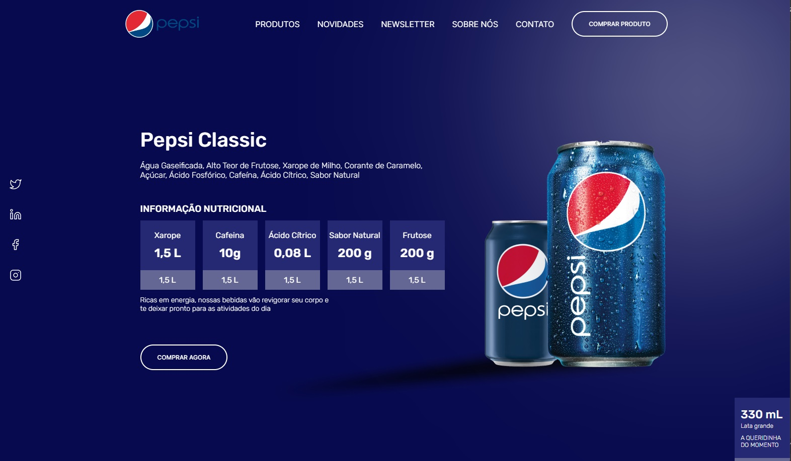

# Pepsi Landing Page

## Autor

**Emerson Felix de Souza**  
- Email: emersonfsti@gmail.com
- GitHub: [github.com/emersonfsti](https://github.com/emersonfsti)

## Agradecimento Especial

Gostaria de estender um agradecimento especial ao Canal do YouTube Senhor Programador](https://www.youtube.com/@srprogramador) por sua inspiração e orientação valiosas neste projeto. Seu conteúdo no video LANDING PAGE com HTML e CSS - Tutorial Completo[(https://youtu.be/2nVlnsUPQig?feature=shared)]YouTube tem sido uma fonte incrível de conhecimento e inspiração para mim. 

## Sobre o Projeto

Este projeto é uma recriação da página inicial da Pepsi, usando HTML e CSS. A Pepsi é uma marca icônica, e esta página tem como objetivo demonstrar habilidades de design e desenvolvimento front-end.

## Visualização

Você pode visualizar o projeto [aqui](link-para-o-projeto).

## Capturas de Tela

Aqui esta a imagem do resultado final apos codificação.

## Características

- **Design Responsivo**: A página é totalmente responsiva, adaptando-se a diferentes tamanhos de tela.
- **Efeitos de Transição**: Usei animações e efeitos de transição para tornar a página mais dinâmica.
- **Contador**: Há um contador que mostra a contagem regressiva para algum evento especial.
- **Design Atraente**: O design da página é inspirado no site oficial da Pepsi e busca reproduzir a aparência e a sensação da marca.

## Como Usar

1. Clone este repositório ou faça o download dos arquivos.
2. Abra o arquivo `index.html` em seu navegador preferido.
3. Explore a página da Pepsi Landing Page e experimente os efeitos interativos.

## Agradecimento

/@srprogramador.

## Licença

Este projeto é licenciado sob a Licença XYZ. Consulte o arquivo [LICENSE](LICENSE) para obter mais detalhes.

---

Divirta-se explorando a Pepsi Landing Page! Se você tiver alguma dúvida ou feedback, não hesite em entrar em contato. Espero que este projeto o inspire em seu próprio trabalho de desenvolvimento web.
